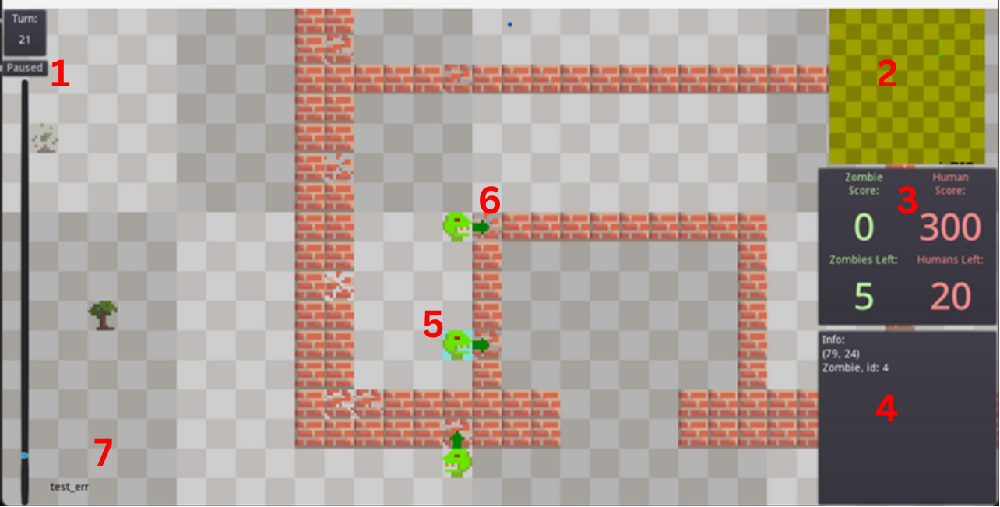

### [website](https://mechmania.org) | [python-starterpack](https://github.com/MechMania-29/python-starterpack) | [java-starterpack](https://github.com/MechMania-29/java-starterpack) | visualizer | [engine](https://github.com/MechMania-29/engine) | [wiki](https://github.com/MechMania-29/Wiki)

# MechMania Visualizer

The MechMania visualizer takes a gamelog (a large json file) output by the [engine](https://github.com/MechMania-29/engine) (what runs games between bots), and will visualize what happenned in the game.
This allows you to view what's actually going on it your games and adjust your bots accordingly.

---

# Installation

We provide the visualizer on the [mechmania website](https://www.mechmania.org/visualizer/MechMania29.html). You should be able to use that without having to install anything.

If you encounter issues, you can install the visualizer manually by downloading [the latest release](https://github.com/MechMania-29/Visualizer/releases) and run the .exe.

The visualizer was developed with the Godot game engine. If you'd like to open this in Godot, you can download [Godot v3.4.2](https://godotengine.org/download/archive/3.4.2-stable/) as the visualizer is stable on that version.

If the visualizer refuses to accept your gamelog and pops up the file select again, you have most likely uploaded the wrong file. Try again and be careful to select the right file. If the problem persists, contact the Mechmania staff, and we should be able to fix your issue promptly.

# Controls
  ##### Keyboard controls
  Use WASD or the arrow keys to pan the camera, and use R to zoom in, and F to zoom out. Press space to pause and unpause the simulation.
  ##### Mouse controls
  Left click and drag to pan the camera. Scroll to zoom in and out. Right click to select a square for more information.

# Game Board

 1. This is the timeline, which displays which turn it is, and offers another way to pause and play the simulation. Click and drag the timeline to quickly view another turn.
  2. This is a minimap. Only humans, displayed as black dots, and zombies, displayed as green dots, are shown on the minimap.
  3. This shows the number of humans and zombies left at the current turn, as well as the final score for both.
  4. This shows the coordinates of and the terrain or actors in the selected square for your current turn. Right click to select a different square.
  5. This blue square highlights which square you have selected to display info for.
  6. These arrows display attacks or actions made by actors on the turn. Dark green arrows are zombie attacks, black arrows are human attacks, yellowish arrows are human builder builds, and light red arrows are human medic heals. Note there is no arrow if an actor targets something sharing the same square as itself.
  7. If either bot has any errors from the engine, they will be displayed here. If you don't see anything, you have no errors (at least, none that are logged by the engine).
